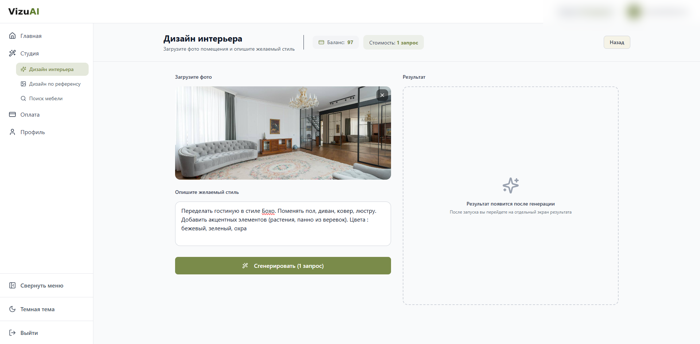
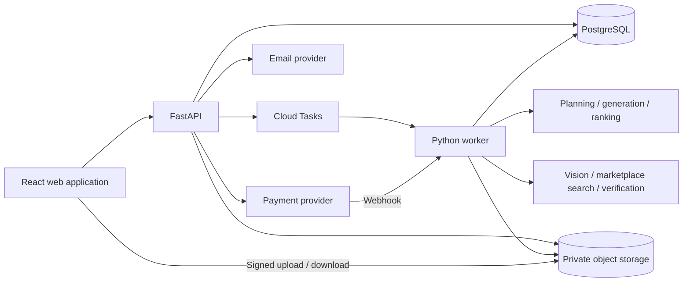
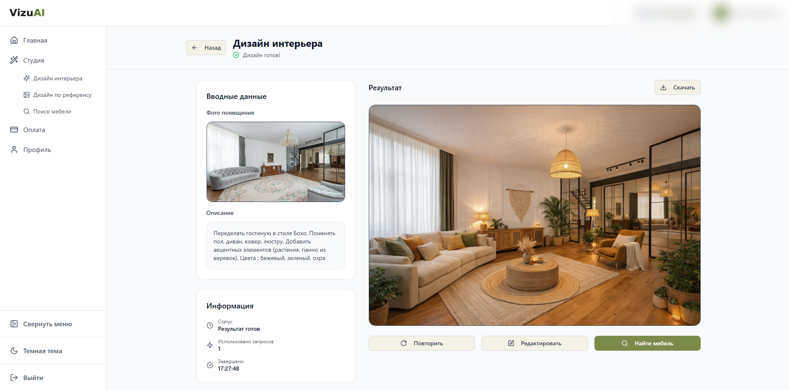
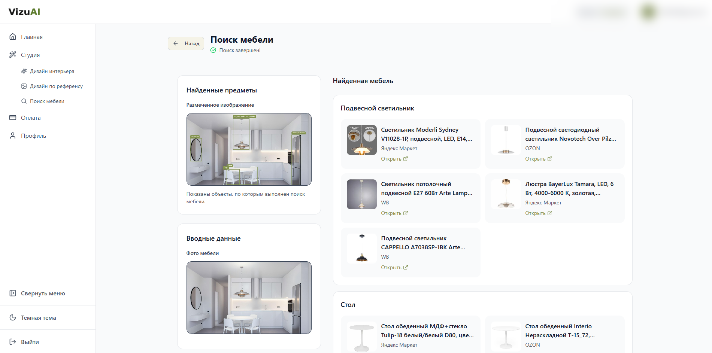

# VizuAI

An AI interior-design application built and shipped by Maxim Ivanov. Users could
redesign a room from a photo, use another interior as a style reference, or find
similar furniture across marketplaces.

**Status: discontinued.** The hosted service is offline. This repository is a
sanitized source release for portfolio review and independent experimentation.
It contains the application and AI workflows, with a fresh Git history and no
production credentials, customer records, or internal operational notes.



## What I built

- A React/TypeScript web application with image uploads, saved drafts, asynchronous
  jobs, result history, and before/after examples
- A Python/FastAPI API with email magic-link authentication, cookie sessions,
  account ownership checks, signed media URLs, and an idempotency layer
- A generation pipeline with request planning, image preparation, batched A/B
  image generation, provider retries/fallbacks, and AI-assisted result selection
- Furniture discovery across Ozon, Yandex Market, and Wildberries, combining
  object localization, visual search, query generation, and candidate verification
- Payment integration with T-Bank, webhook processing, a credit ledger, and saved
  request recovery after payment
- Russian/English public pages and core account flows, build-time prerendering of
  24 public routes, per-route metadata, structured data, and consent-based analytics
- Separate web, API, and worker containers, originally deployed on Google Cloud
  Run with Cloud Tasks, PostgreSQL, and private Cloud Storage

The original product also had a Telegram interface. Its code is retained as a
legacy integration; the web application is the primary architecture.

## Architecture



See [architecture and tradeoffs](docs/architecture.md) for workflow details,
entrypoints, persistence, and limitations.

## Explore the code

| Area | Entry point |
| --- | --- |
| Application UI | [`frontend/web/src/app/pages/app`](frontend/web/src/app/pages/app) |
| HTTP API | [`web_api/routes`](web_api/routes) |
| Business services | [`app_services`](app_services) |
| Interior generation | [`pipeline/simple_pipeline.py`](pipeline/simple_pipeline.py) |
| Furniture search and orchestration | [`pipeline/orchestrator.py`](pipeline/orchestrator.py) |
| Provider integrations | [`services`](services) |
| Production prompt templates | [`prompts`](prompts) |
| Database schema and migrations | [`models`](models), [`alembic`](alembic) |
| Automated tests | [`tests`](tests) |

## Preview the public pages

Use Node.js 24 and pnpm 10.32.1. No API key or Google Cloud account is needed to
build and view the public pages.

```bash
corepack enable
cd frontend/web
pnpm install --frozen-lockfile
pnpm dev --host 127.0.0.1
```

Open `http://127.0.0.1:5173` for Russian or `/en` for English. Authenticated
features require your own backend. Login, generation, and payments do not become
available merely by starting the frontend. The browser may report unavailable
API requests when no local API is running.

```bash
pnpm build
```

The build prerenders 24 public routes and verifies metadata, canonical URLs,
JSON-LD, page content, and a separate neutral `spa.html` for private routes.

## Backend and self-hosting

Use Python 3.11 or 3.12. See [local setup](docs/local-development.md) for the
required services and configuration. Hosted integrations require your own
accounts and may incur charges. Model names describe the original configuration;
provider availability and pricing may have changed.

```bash
python -m venv .venv
source .venv/bin/activate
pip install -r requirements-dev.txt
python -m pytest --disable-socket --allow-unix-socket
```

The source release is an engineering archive, not a one-command replacement for
the retired production environment. Known limitations and verification results
are recorded in [validation](docs/validation.md).

## Screenshots

### Generated interior and source inputs



### Furniture search



## Publication changes

Private work logs, customer/debug exports, deployment identifiers, operator legal
details, and the original Git history are excluded. Example hosts use the reserved
`.example` domain. Analytics requires explicit configuration and consent. The
legal pages are anonymized historical examples, not current service terms.

## License

The code is available under the [MIT license](LICENSE). Third-party packages,
photographs, and trademarks retain their own licenses and rights; see
[third-party notices](THIRD_PARTY_NOTICES.md).
